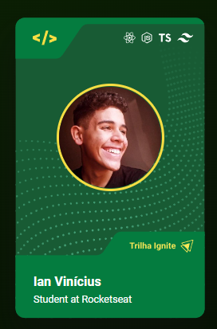

# NLW Copa - Minha figurinha

## Introdução 

Minha própria figurinha da copa! Projeto simples usando a tríade web.

## ⚙️ Tecnologias implementadas

- ``HMTL``
- ``CSS``
- ``JS``

## 🌌 Ambientes de desenvolvimento

- ``Visual Studio Code``

## 🌠 Sites utilizados

- ``Github``

## 📌 Visualizar o projeto
- Acione a função dando um clique na figurinha!
- Acesse através [deste link](https://nerdaleatorio.github.io/figurinha-da-copa).

## 👨🏻‍🎓 Desenvolvedor

| [ Ian Vinícius Vasconcelos](https://github.com/NerdAleatorio) |  
| :---: | 
